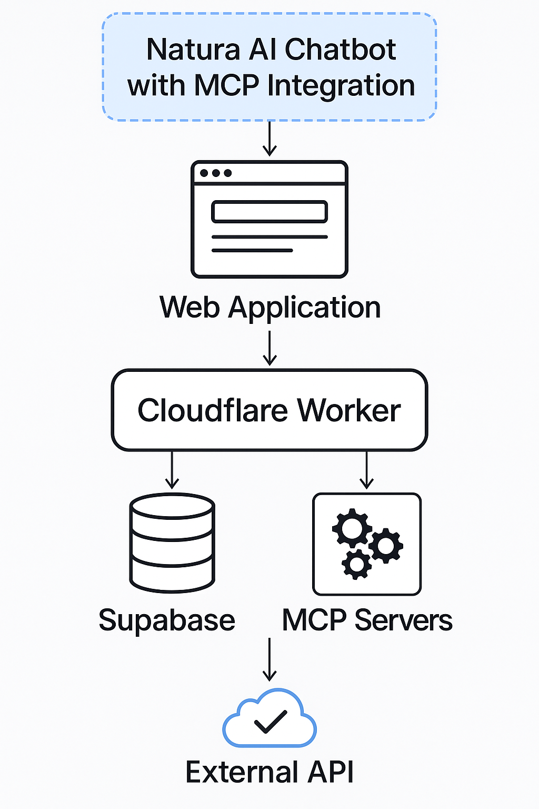

<div align="center">


# 🌿 Natura AI – Digital Wellness Coach

[](LICENSE)


</div>


---

## 🎥 Demo  
👉 *Add your video demo link here (YouTube or Cloudflare Stream).*  

---

## 🎯 Project Vision  
In a world overloaded with screens and distractions, **Natura AI** redefines digital interaction:  
> Let technology serve **you**, not consume you.

This prototype demonstrates a human‑centred AI assistant focused on **digital wellness**, powered entirely by free, serverless technologies.

---

## 🏗 Features Overview  
- 🔐 **Authentication via Supabase** – email/password login, per‑user storage.  
- 💬 **Chat Interface** – persistent multi‑session messaging with automatic scroll, local storage per user.  
- 🧩 **MCP Servers Panel** – add/remove external tool servers dynamically from UI.  
- ⚙️ **Dynamic Tool Invocation** – messages containing specific keywords trigger direct tool calls instead of LLM processing.  
- 🧘 **Wellness Coach MCP** – built‑in tool server providing:  
  - `/screen_time_reminder` → screen‑time awareness and break suggestion  
  - `/digital_detox_tip` → digital detox micro‑actions  
  - `/mindfulness_exercise` → short mindfulness exercises  
  - `/focus_mode` → Pomodoro‑style focus timer  
  - `/human_connection_suggestion` → human connection encouragement  
- 🧠 **Fallback LLM Mode** – powered by Cloudflare’s `@cf/meta/llama‑3.1‑8b‑instruct`.  
- ☁️ **100 % Serverless Architecture** – Cloudflare Workers + Cloudflare Pages + Supabase free tier.

---

## 🧰 Technology Stack  
| Layer | Technology | Purpose |
|-------|-------------|----------|
| **Frontend** | React 18 + Vite | UI/UX chat application |
| **Styling** | Tailwind CSS | Responsive minimal design |
| **Backend** | Cloudflare Workers | Serverless chat API + MCP logic |
| **Database / Auth** | Supabase (PostgreSQL + Auth API) | Stores users + MCP servers |
| **AI Engine** | Cloudflare AI Gateway (Llama 3.1 8B) | Natural language responses |
| **Tool Protocol** | MCP (Model Context Protocol) | External tool integration |

---

## 🖼 Architecture Diagram  
  

```
User (React Frontend)
        ⇩
Backend Worker (Cloudflare)
        ⇩
 ┌───────────────┐
 │  Wellness MCP │
 │  Other MCPs   │
 └───────────────┘
        ⇩
     Supabase DB
```

---

## 🚀 Deployment (Free Tier)

### 1️⃣ Backend Worker
1. Create a new Cloudflare Worker named `nicbl`.  
2. Add env vars:  
   - `SUPABASE_URL`  
   - `SUPABASE_ANON_KEY`  
3. Deploy – obtain URL (e.g. `https://nicbl.yourdomain.workers.dev`).

### 2️⃣ Wellness Coach Tool Server
1. Create another Cloudflare Worker `wellness-coach`.  
2. Paste `wellness-coach.js` code (provides endpoints above).  
3. Deploy → get URL (e.g. `https://wellness-coach.yourdomain.workers.dev`).

### 3️⃣ Frontend
1. Push the React app to GitHub.  
2. On Cloudflare Pages → Connect Repo.  
3. Build cmd `npm run build` → Output `dist`.  
4. Deploy → URL like `https://naturaai.pages.dev`.

### 4️⃣ Connect
Set `API_URL` in frontend to backend Worker URL.  
In UI → *MCP Servers* → Add:  
```
Name: Wellness Coach
URL:  https://wellness-coach.yourdomain.workers.dev
```
Then send message “I’m tired” → instant wellness response 🌱

---

## 💻 Usage Flow
1. **Login** or **Sign Up**  
2. **Add MCP Server(s)** from sidebar  
3. **Start a New Chat**  
4. **Send messages** like:  
   - “I’m tired” → screen‑time reminder  
   - “Give me a detox tip” → detox tip  
   - “Activate focus mode” → focus tool  
   - “I want to feel connected with others” → connection advice  
5. Enjoy instant tool responses or LLM fallback.

---

## 📸 Screenshots  
| Feature | Preview |
|----------|----------|
| **Login Screen** |  |
| **Chat UI** |  |
| **MCP Servers Panel** |  |

---

## 📜 Changelog  
| Version | Date | Changes |
|---------|------|----------|
| **v0.1.0** | 2025‑11‑02 | Initial release – chat, auth, MCP integration. |
| **v0.1.1** | 2025‑11‑02 | UI improvements + added tool discovery panel. |
| **v0.2.0** | 2025‑11‑03 | Implemented Wellness Coach MCP server + focus mode. |

---

## 🔮 Future Roadmap   
- Integration with wearables (Google Fit / Apple Health)  
- MCP Marketplace for external tools  
- Enhanced LLM context awareness
- Email confermartion signup

---

## 🔐 Security & Privacy  
- User auth handled via Supabase Auth (JWT).  
- No sensitive data stored client‑side except token and chat history.  
- CORS & rate‑limiting implemented on Workers.  
- All requests served over HTTPS via Cloudflare.

---

## 🤝 Credits  
Developed by **Niccolò Balestrieri**  
Inspired by the vision of *Natura Umana · Natura AI*  

**License:** MIT  
Feel free to fork and extend.  
